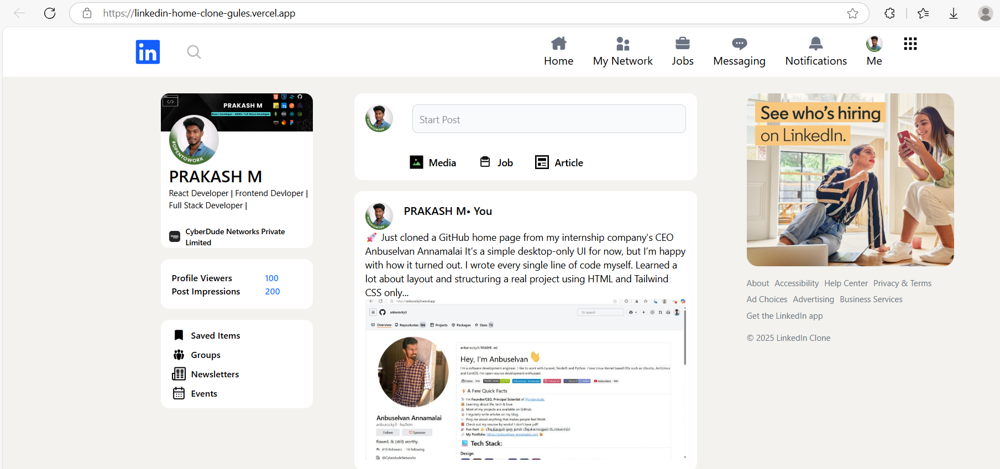

# LinkedIn Feed UI Clone

## 📸 Screenshot

This project is a **UI clone of the LinkedIn feed**, built as part of my internship at **CyberDude Networks Private Limited**.

The goal of this project was to understand and practice modern layout techniques using **CSS Grid** and **Flexbox** with **Tailwind CSS**.

## 🔧 Tech Stack
- HTML
- Tailwind CSS

## 🎯 What I Learned
- Building complex layouts using **Grid**
- Aligning and structuring components using **Flexbox**
- Creating clean and reusable UI sections
- Improving UI consistency and spacing

## ⚠️ Note
- This is a **UI-only** project
- Desktop view only (not responsive)
- No backend or functionality included

## 📌 Credits
Original design inspired by **LinkedIn** (for learning purposes only).
